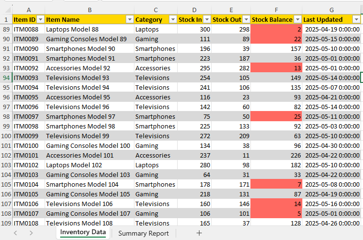
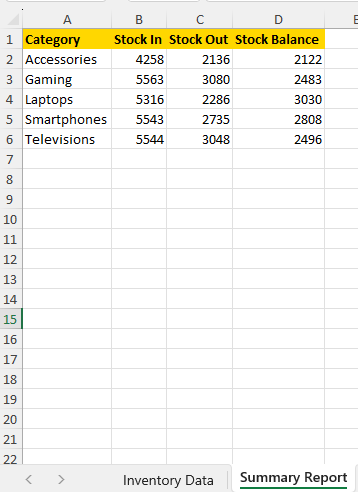

# 📊 Automated Excel Report Generator — Inventory Edition

This project automates the process of reading raw inventory data from Excel, analyzing it with Python, and exporting a clean, formatted report with key insights like **low stock alerts** and **category summaries.**

---

## 📁 Table of Contents

- [Project Overview](#project-overview)
- [Tools & Libraries](#Tools-&-Libraries)
- [How It Works (Automation Logic)](#How-It-Works-(Automation-Logic))
- [Sample Input Columns (Excel)](#Sample-Input-Columns-(Excel))
- [Business Use Case](#Business-Use-Case)
- [Output Features](#Output-Features)
- [Limitations](#Limitations)
- [Future Improvements](#future-improvements)
- [How to Use](#How-to-Use)

---

## 📌 Project Overview

Businesses frequently deal with inventory data in Excel. This script streamlines the process of turning raw Excel data into a meaningful report — saving hours of manual work and reducing the chances of human error.

---

## 🧰 Tools & Libraries

- Python
- pandas
- openpyxl

---

## 📂 How It Works (Automation Logic)

1. **Reads** raw Excel data using `pandas`.
2. **Processes** the data: calculates totals by category, identifies low stock items.
3. **Creates** a formatted Excel file:
   - Adds color-coded alerts for low stock.
   - Generates a summary sheet (total stock by category).
   - Applies styled headers for clarity.

---

## 🧪 Sample Input Columns (Excel)

| Product Name | Category    | Stock In | Stock Out | Stock Balance |
| ------------ | ----------- | -------- | --------- | ------------- |
| Power Bank   | Electronics | 50       | 20        | 30            |
| Earphones    | Electronics | 40       | 15        | 25            |

---

## 💼 Business Use Case

Imagine a small-to-medium-sized retail store:

- Staff can **update inventory daily** in Excel.
- The script **automatically flags** low-stock products.
- Managers get a **summary by category** to inform restocking decisions.
- This saves time, increases accuracy, and enhances inventory planning.

---

## 📌 Output Features

✅ **Inventory Sheet**

- Styled header with bold fonts and colors
- Conditional formatting: Highlights rows where **stock balance is below 30 units**

✅ **Summary Sheet**

- Automatically aggregates and displays:
  - Total **Stock In**
  - Total **Stock Out**
  - Remaining **Balance**
- Grouped by **Category** for easy insights

✅ **Automated Workflow**

- Just update the Excel file — no manual edits required
- Script processes everything and saves a formatted report in seconds

---

## 📎 Limitations

- Assumes column names and sheet structure remain **unchanged**
- Uses basic formatting — **charts and advanced visuals** can be added manually or in future updates
- Low stock alert is currently **fixed at 30 units** (but customizable in the script)

---

## 🔧 Future Improvements

- Add chart visualizations for trends and summaries
- Export reports in PDF or HTML
- Email integration for automated alerts
- Custom threshold setting via UI or config file

## 🔄 How to Use

1. Replace the Excel file with your raw inventory data (same column names).
2. Run the script.
